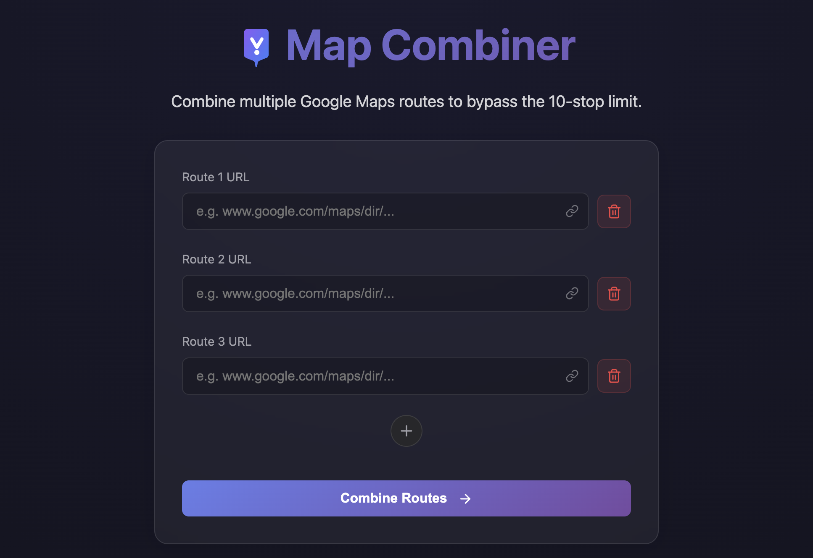

# MapCombiner

MapCombiner is a tool that allows users to combine multiple Google Maps links into a single new link, bypassing the 10-stop limit. It is a totally free, open-source web application with native mobile apps available on both iOS and Android.

## Main Page

## Access
It can be accessed through web, iOS, Android

### 1. Web
You can access the online website through [https://mapcombiner.travel-tracker.org/](https://mapcombiner.travel-tracker.org/)

### 2. Mobile App
You can download the mobile app from the App Store and Google Play Store by scanning the QR code below:

# Features

- **Bypass Stop Limits**: Merge multiple Google Maps route URLs (10 stops each) into one continuous journey.
- **Cross-Platform**: Unified experience across **Web, iOS, and Android** powered by Capacitor.
- **Privacy-Centric**: All processing happens locally; no data ever leaves your device unless you share it.
- **Route History**: Automatically remember your recently combined journeys with local persistence.
- **Native Sharing**: Instant sharing of combined links through messaging apps or social media.
- **QR Code Integration**: Quickly switch between desktop and mobile with easy-to-scan store links.
- **Premium UI/UX**: Aesthetic dark-mode glassmorphism interface with smooth motion effects and transitions.
- **Advanced Parsing**: Integrated with Travel Tracker's MapParser for deeper insights and alternate route processing.

## Contact

For questions, suggestions, or feedback, please contact maintainer: **changzhiai@gmail.com**
